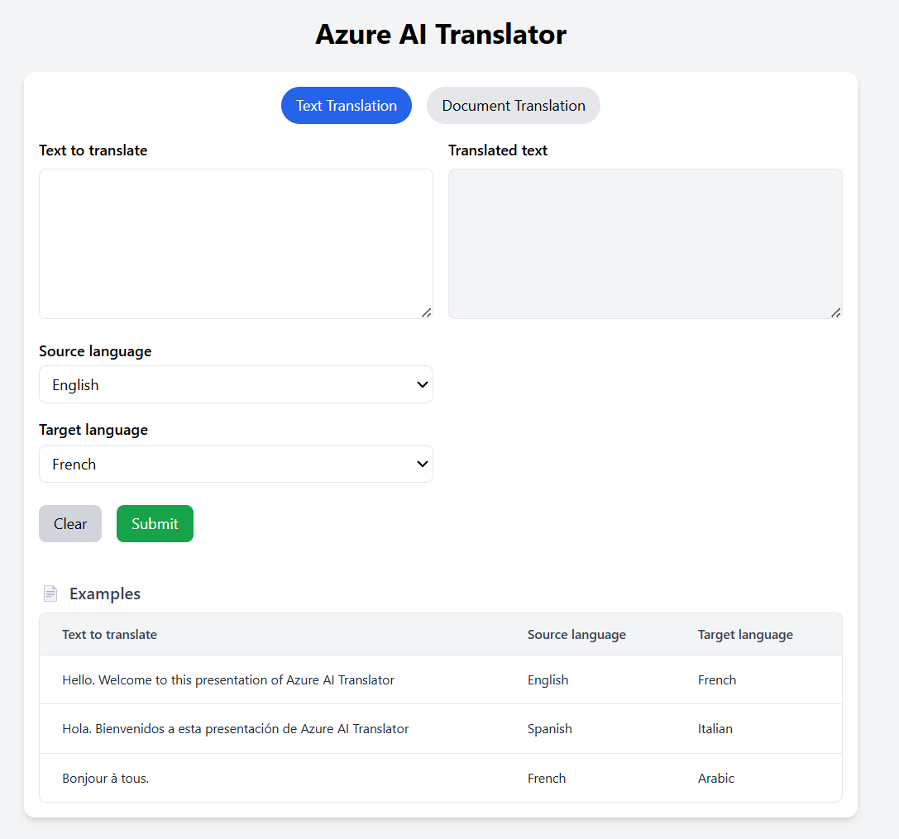
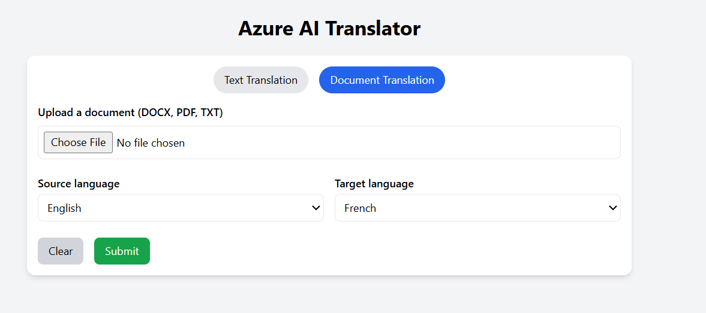

# 🌍 Azure Translator Web App (React + Node.js)

This is a full-stack application that leverages **Azure Translator Services** to perform both **text translation** and **document translation** using Azure's REST APIs. Built with **React** on the frontend and **Node.js (Express)** on the backend.




---

## 🚀 Features

### 🔤 Text Translation
- Translate plain text from one language to another
- Select from dynamically fetched list of Azure-supported languages
- Auto-fill common example phrases for one-click testing

### 📄 Document Translation (Single File - Sync)
- Upload `.txt`, `.pdf`, `.docx`, or `.html` documents
- Get translated document back instantly using Azure's synchronous document API
- Frontend validation for file size and supported types
- Real-time loading indicator for uploads

---

## ⚙️ Azure Setup

You will need:
1. An Azure Translator resource (Cognitive Services)
2. A Translator endpoint (e.g., `https://<name>.cognitiveservices.azure.com`)
3. Subscription key and region (e.g., `eastus`)

### 🧪 Enable Document Translation
Ensure your Azure Translator instance supports **document translation**. You can validate by testing in [Azure API Reference](https://learn.microsoft.com/en-us/azure/ai-services/translator/document-translation/overview).

---

## 🛠️ Local Setup

### 📁 Folder Structure

```
translate/
├── frontend/           # React app
├── backend/            # Node.js Express server
├── uploads/            # Temporary uploaded files
├── translated/         # Output translated files
└── .env                # Environment variables
```

### 🔧 Environment Variables (`.env`)
Create `.env` in the backend root with:

```dotenv
AZURE_TRANSLATOR_KEY=your-translator-key
AZURE_REGION=eastus
AZURE_DOCUMENT_TRANSLATOR_ENDPOINT=https://<your-endpoint>.cognitiveservices.azure.com
PORT=5000
```

---

## ▶️ Running the App

### 1. Backend (Node.js)
```bash
cd backend
npm install
node index.js
```

Runs on [http://localhost:5000](http://localhost:5000)

### 2. Frontend (React + Tailwind)
```bash
cd frontend
npm install
npm run dev
```

Runs on [http://localhost:5173](http://localhost:5173)

---

## 📂 Supported File Types

| File Type | Content Type (MIME)                                     |
|-----------|---------------------------------------------------------|
| `.txt`    | `text/plain`                                            |
| `.pdf`    | `application/pdf` (must be machine-readable, not scanned) |
| `.docx`   | `application/vnd.openxmlformats-officedocument.wordprocessingml.document` |
| `.html`   | `text/html`                                             |

---

## 🧩 Known Issues / Notes

- Azure will reject PDFs that are encrypted, scanned (image-only), or malformed
- `.docx` must be in modern Word format (not `.doc`)
- Translated files are saved in `/translated` and served statically from backend
- For large-scale or multi-doc translation, use Azure’s async document batch API

---

## 🤝 Contributions

Pull requests are welcome! Please open an issue first to discuss your changes.

---
